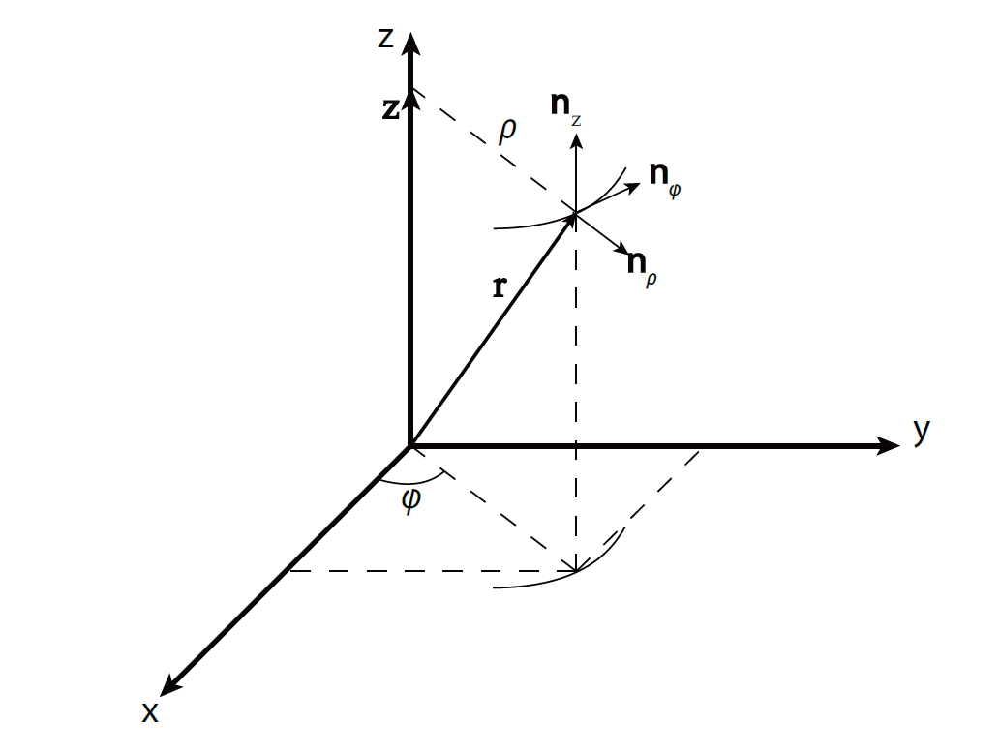
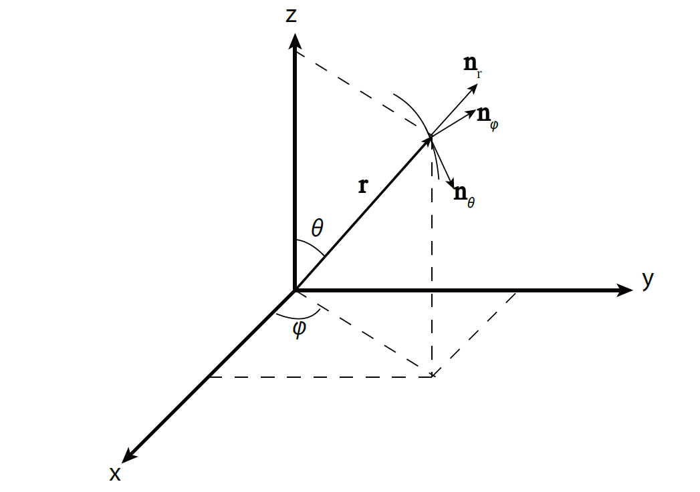

# VP160 RC1
Github: https://github.com/joydddd/VP160-2020-SU-NOTES

you may need chrome + MathJax Plugin for Github to view properly

Github version will be the most up to date one. 
## Concepts
Physical Quantities: ALWAYS number + unit

Scale / Vector ? 

Numbers

* Scientific notation: $6.02 \times 10^{23}$
* significant figures
* uncertainty 
  * e.g. $1.259 \pm 0.001 \mu A$ 

Units

* unit prefixes: nm($10^{-9}$, nano), $\mu m$($10^{-6}$, micro), um ($10^{-3}$, mili), km ($10^3$, kilo) ... 
* unit conversions

Vectors

* addition/ constant multiplication/ subtraction --> vector
* dot product: vector . vector --> scale 
  * $$\overrightarrow{u}\cdot\overrightarrow{v} = \left<\left(\begin{matrix} u_x\\u_y\\u_z \end{matrix}\right), \left(\begin{matrix} v_x\\v_y\\v_z \end{matrix}\right)\right> =u_x v_x
  + u_y v_y + u_z v_z
  * e.g. $P = \overrightarrow{F} \cdot \overrightarrow{v}$ = $|\overrightarrow{F}|  |\overrightarrow{v}| cos \theta$
* cross product: vector x vector --> vector
  * $$ \overrightarrow{u} \times \overrightarrow{v} = 
    \left|\begin{matrix} 
    \hat{x} & \hat{y} &\hat{z} \\
    u_x & u_y & u_z\\
    v_z & v_y & v_z\\
    \end{matrix}
    \right|
    = \left|\begin{matrix} u_y & v_z \\v_y & v_z \\\end{matrix}\right|\hat{x}-\left|\begin{matrix} u_x & v_z \\v_x & v_z \\\end{matrix}\right|\hat{y}+\left|\begin{matrix} u_x & v_y \\v_x & v_y \\\end{matrix}\right|\hat{z}
    $$
  * e.g. $\overrightarrow{F} = I \overrightarrow{L} \times \overrightarrow{B}$
  * length: the cross section area of two vector $|\overrightarrow{F}| = I |\overrightarrow{L}| |\overrightarrow{B}| sin \theta$
  * direction: right handed rule

## Coordinate Systems
* Cartesian
  * $|\overrightarrow{w}|=\sqrt{w_{x}^{2}+w_{y}^{2}+w_{z}^{2}}$
  * {$\hat{n_{x}}$, $\hat{n_{y}}$, $\hat{n_{z}}$} / {$\hat{i}$, $\hat{j}$, $\hat{k}$} 
    * mutually perpendicular $\hat{n_{x}} \cdot \hat{n_{y}} =0$
    * unit length $|\hat{n_{x}}| = 1$
    * Right-hand Rule $\hat{n_{x}} \times \hat{n_{y}} = \hat{n_{z}}$
  * $\overrightarrow{r}=x\hat{n_{x}}+y\hat{n_{y}}+z\hat{n_{z}}$
    * differentiate: $\frac{\text{d}\overrightarrow{u}}{\text{d}t}=\frac{\text{d}}{\text{d}t}\left( u_{x}(t)\hat{n_{x}}+u_{y}(t)\hat{n_{y}}+u_{z}(t)\hat{n_{z}}\right) = \dot{u_{x}}(t)\hat{n_{x}}+\dot{u_{y}}(t)\hat{n_{y}}+\dot{u_{z}}(t)\hat{n_{z}}$\\
    * integrate
    * dot product $\overrightarrow{u}\cdot \overrightarrow{w}=u_{x}w_{x}+u_{y}w_{y}+u_{z}w_{z}$
    * cross product $\overrightarrow{u}\times \overrightarrow{w}=(u_{y}w_{z}-u_{z}w_{y})\hat{n_{x}}+(u_{z}w_{x}-u_{x}w_{z})\hat{n_{y}}+(u_{x}w_{y}-u_{y}w_{x})\hat{n_{z}}$
* Cylindrical

  * {$\hat{n_{\rho}}$, $\hat{n_{\varphi}}$, $\hat{n_{z}}$}
    * $\rho=\sqrt{x^{2}+y^{2}}$
    * $\varphi=\text{arctan}\frac{y}{x}$
    * $z=z$
    * $x=\rho \text{cos}\varphi$
    * $y=\rho \text{sin}\varphi$
  * $\overrightarrow{r}=\rho\hat{n_{\rho}}+z\hat{n_{z}}$
    * NOT directly differentiable!!! Will discuss later
* Spherical

  * longitude and latitude system
  * {$\hat{n_{r}}$, $\hat{n_{\varphi}}$, $\hat{n_{\theta}}$}
    *  $\rho=\sqrt{x^{2}+y^{2}+z^{2}}$ 
    *  $\varphi=\text{arctan}\frac{y}{x}$ ($0, \pi$)
    *  $\theta=\text{arctan}\frac{\sqrt{x^{2}+y^{2}}}{z}$ ($0,\pi/2$)
    * $x=r \text{sin}\theta \text{cos}\varphi$
    * $y=r \text{sin}\theta \text{sin}\varphi$
	* $z=r\text{cos}\theta$
  * $\overrightarrow{r}=r\hat{n_{r}}$
    * NOT directly differentiable!!! Will discuss later
* 2D polar coordinates
  * Cylindrical coordinates with $z = 0$
  * Spherical coordinates with $\theta = 0$

## 1D kinematics
### Average vs. Instantaneous 
Velocity
* average velocity: 
  * $v_{\text{av,x}}=\frac{x(t+\Delta t)-x(t)}{\Delta t}$
* velocity 
  * When the time interval $\Delta t$ -> 0
  * $\frac{\text{d}x(t)}{\text{d}t}=\dot{x}(t)\overset{\text{def}}{=}v_{x}(t)$
  * velocity is location change rate w.r.t time

Acceleration
* average acceleration
    * $a_{\text{av,x}}=\frac{v_{x}(t+\Delta t)-v_{x}(t)}{\Delta t}$
* acceleration 
  * When time interval $\Delta t$ -> 0
  * $a_{x}(t)=\frac{\text{d}v_{x}(t)}{\text{d}t}=\dot{v_{x}}(t)=\frac{\text{d}^{2}x(t)}{\text{d}t^{2}}=\ddot{x}(t)$
  * acceleration is velocity change rate w.r.t and twice differentiation of position w.r.t time. 

see lecture notes for pics

### Relativity of Velocity/acceleration

