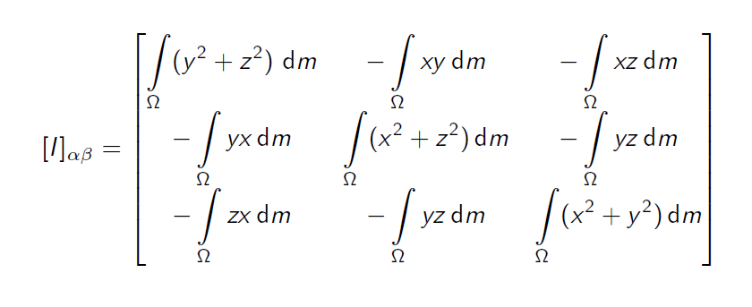

## Rotation
Origin: wherever you feel easy to analyze
usually where multiple forces join, or the application point of a force whose direction you don't know
### Torque 
<-> force
- $\vec{\tau} = \vec{r} \times \vec{F}$
### Angular momentum
<-> momentum
- $\vec{L} = \vec{r} \times \vec{p}$
- $\vec{\tau} = \frac{d\vec{L}}{dt}$ <=> $\vec{L}(t_1) - \vec{L}(t_2) = \int_{t_1}^{t_2} \vec{\tau} dt$

Example: planet orbital (origin at the sun)
exam: the angular momentum of a planet following a ellipse/hyperbola orbital

## Rigid Body
- A system of particals with their relative directions fixed. 
- degree of freedom: 6
### Describe the position of a rigid body
- center of mass FOR
  - translational motion of G (DoF 3): described by $\vec{r}$ in 3D
  - rotation w.r.t. G (DoF 3): described by $\vec{\omega}$ in 3D
  
### Angular momentum
(under centre of mass FoR)
For a partical at $\vec{r'}$ 
$\vec{P_i} = m_i\vec{\omega} \times \vec{r'}$
$\vec{L_i} = m_i\vec{r'}\times(\vec{\omega} \times \vec{r'})$
$ \vec{a} \times (\vec{b}\times \vec{c}) = (\vec{a}\cdot\vec{c})\vec{b} - (\vec{a}\cdot\vec{b})\vec{c}$
$ \vec{L_i}= m_ir'^2\vec{\omega} - m_i (\vec{r'}\cdot \vec{\omega})\vec{r'}$

Our goal: $\vec{L} = \mathfrak{I}\vec{\omega}$, $\mathfrak{I}$: 3x3 matrix
